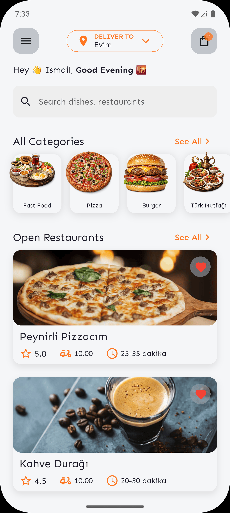
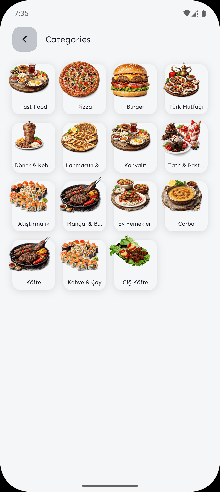
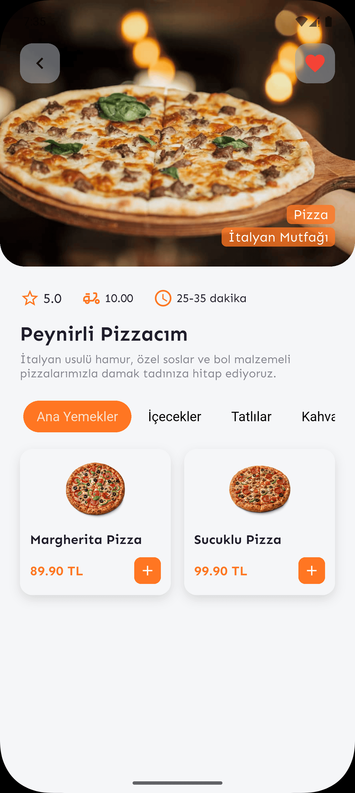
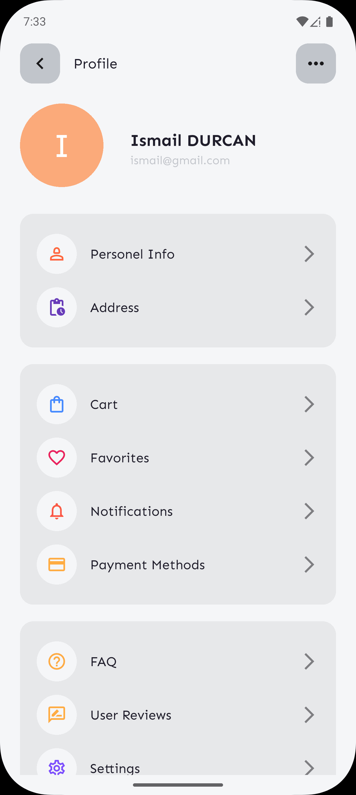

# Yumzi

Yumzi is a robust and scalable food delivery Flutter application designed to provide a fast and seamless ordering experience for users. It allows users to browse restaurants, explore menus, and track their food orders in real-time. Built with modern Flutter state management and UI approaches, it ensures a smooth and engaging user interface.

## 📱 Designed Screens
*Number of designed screens: **17 Screens***

## 📸 Screenshots & Visuals

Here are some glimpses of the application interface:

<p float="left">
  
  
  
  
</p>

👉 **[Click here to view all screenshots](assets/images/ss/)**

## 🚀 Features & Technologies

This repository features the application frontend implemented in Dart & Flutter, adhering to a layered architecture for separation of concerns and testability.

### 🏛 Architecture and State Management

- **State Management**: [Provider](https://pub.dev/packages/provider) is used for reactive state management, keeping business logic separate from UI presentation.
- **Project Structure**: Feature-driven directory structure separating layers (e.g., `presentation`, `core`, `data`, `config`).
  - `config/`: App routing and environment configurations.
  - `core/`: Core abstractions, networking configurations, and general utility layers (auth, network, storage).
  - `data/`: Data models, services, and repositories handling backend communication.
  - `presentation/`: UI layer including screens, widgets, and state providers.
  - `styles/`: Theming interface, colors, custom fonts setup.
  - `utils/`: Reusable helpers like Debouncers.

### 🔌 Networking & Data Handling

- **Networking**: [Dio](https://pub.dev/packages/dio) for robust HTTP requests, interceptors, and error handling.
- **Local Storage**: [Flutter Secure Storage](https://pub.dev/packages/flutter_secure_storage) for secure, encrypted token/credential management.
- **Authentication**: JWT token processing using [jwt_decoder](https://pub.dev/packages/jwt_decoder) and inputs validation using [email_validator](https://pub.dev/packages/email_validator).

### 🧭 Navigation & Maps

- **Routing**: [GoRouter](https://pub.dev/packages/go_router) for declarative, URL-based deep linking and sophisticated app navigation.
- **Maps**: [flutter_map](https://pub.dev/packages/flutter_map) alongside `latlong2` for rich, interactive mapping and geolocation features.

### 🎨 UI & Design

- **Theming**: A dedicated `<AppTheme>` with custom typography (Sen font family & Google Fonts).
- **Widgets**: Implementation of sophisticated UI tools including `buttons_tabbar` and `top_snackbar_flutter` for clean and user-friendly visual feedback.

## 📂 Project Structure

```
lib/
├── config/       # App routing (go_router setup)
├── core/         # Essential base mechanisms (auth, network clients, secure storage setup)
├── data/         # Repositories, API backend services, and domain models
├── enums/        # App-wide enumerations (routes, message types)
├── presentation/ # Application views
│   ├── providers/ # Provider state classes
│   ├── screens/   # Flutter Pages / Screens
│   └── widgets/   # Reusable UI widgets
├── styles/       # Theming details, Color palettes
├── utils/        # Generic tools like debouncers
└── main.dart     # Application entry-point
```

## 🛠 Getting Started

### Prerequisites

- Flutter SDK (>=3.8.1)
- Dart SDK

### Installation

1. Clone the repository:

   ```bash
   git clone <repository_url>
   cd yumzi
   ```

2. Install dependencies:

   ```bash
   flutter pub get
   ```

3. Run the project:
   ```bash
   flutter run
   ```

## 🛡 Validations & Security

Yumzi implements encrypted persistent storage for access tokens to ensure high app security guidelines. Forms are validated dynamically, and requests utilize Dio interceptors for graceful token expiry handling and global connectivity checks.
